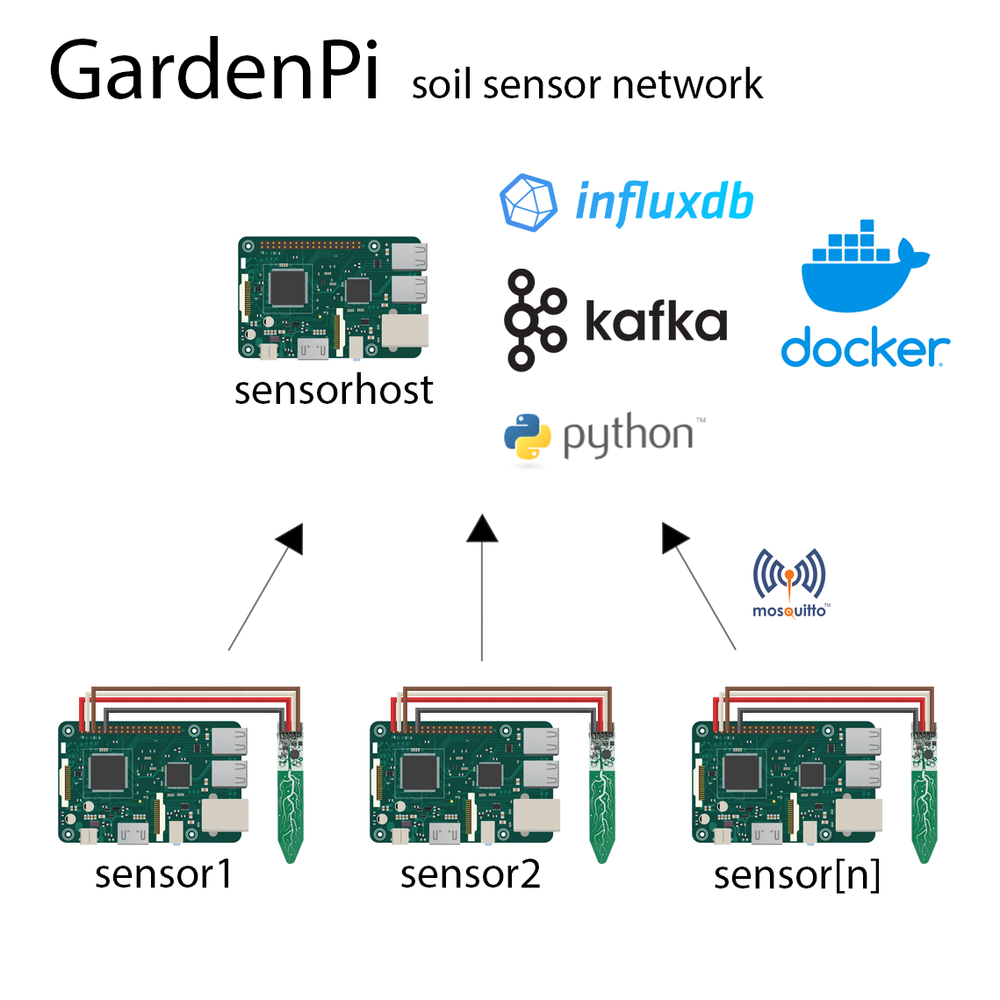
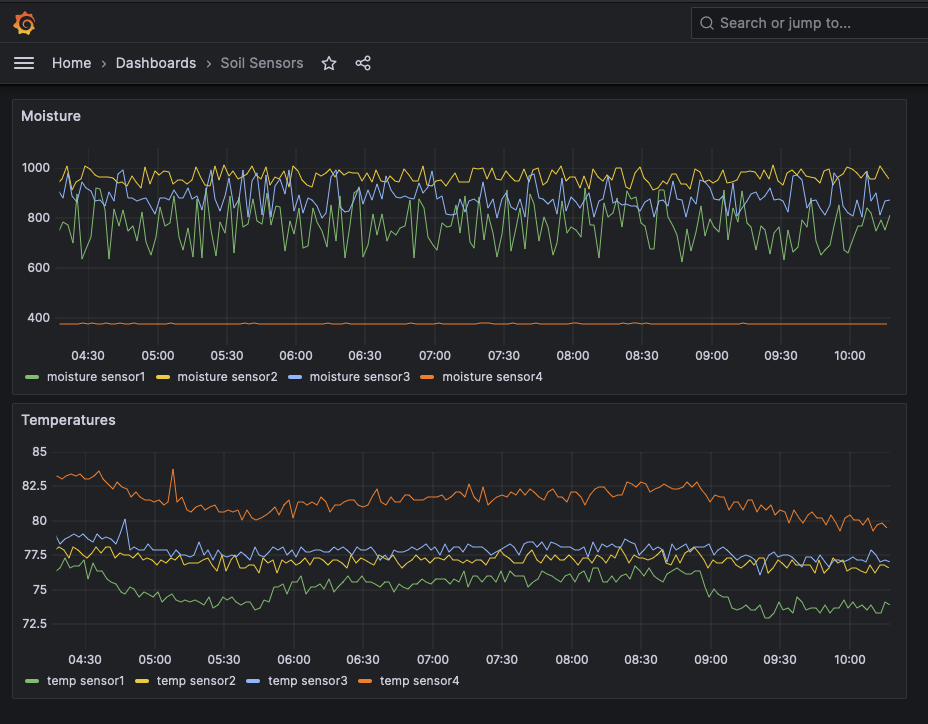

# Garden Pi - Soil sensor network

Store soil readings from physical sensors to a time series database, then publish that data to a Kafka topic. 

A project to demonstrate experience in Python, CI/CD with Github Actions, containerization via Docker, messaging & event-driven architecture using MQTT and Kafka, and time series databases.

After the initial docker compose, sensors will on startup publish soil readings from the "sensor" service as MQTT messages. The "sensorhost" service ingests them into a time series database (influxDB). Stored data is then published to a Kafka topic and available for review in Grafana. This project can utilize a single pi for both sensor and sensorhost containers or on multiple pis for sensors in various locations. 

## Prequisites

#### Equipment list

- Raspberry Pi running Docker (4b used for hosting sensor data, Pi Zero 2 used for each sensor)
- [*Adafruit STEMMA Soil Sensor*](https://www.adafruit.com/product/4026)

## Starting
Clone the Git Repository
    
    git clone https://github.com/jpsurette/garden_pi_public.git

Open the file
    
    $/sensorhost/.env 

And replace the hash marks below with your desired credentials.

    INFLUXDB_USER=##########
    INFLUXDB_PASSWORD=###############
    INFLUXDB_TOKEN=###############
    INFLUXDB_URL=http://influxdb:8086
    INFLUXDB_ORG=houseplants
    INFLUXDB_BUCKET=plant_sensors
    GRAFANA_USER=##############
    GRAFANA_PASSWORD=###############

A 32 character token can be generated by running the below within a pi SSH session or on OS X. 

    openssl rand -base64 32

## Using Github Actions

This project was built using CI/CD practices in Github Actions for the testing and deployment of new code. Github Actions self-hosted runners were installed on each sensor & sensorhost Raspberry Pi.

Once code passed the required tests, it was deployed to the production environment & merged once successful deployment was confirmed.

If you're recreating this project without using Github Actions, follow the below steps.

## Running Manually without Github Actions

To start either a sensor or a sensorhost application and their supporting services, navigate to
    
    >$/garden_pi_public/sensor (to run a sensor)
    
    >$/garden_pi_public/sensorhost (to run a sensorhost and store your database)

For the sensorhost run

    export ENVIRONMENT="production"

    docker compose up -d

For each sensor run

    export HOSTNAME="$(cat /etc/hostname)"
    export ENVIRONMENT="production"

    docker compose up -d

This will save your Pi's hostname to a temporary variable, and that will be used to identify the sensor in influxDB.

The data collected will be available at the endpoint for the influxDB API
[http://influxdb_production:8086/] and published to the Kafka topic "sensordata"